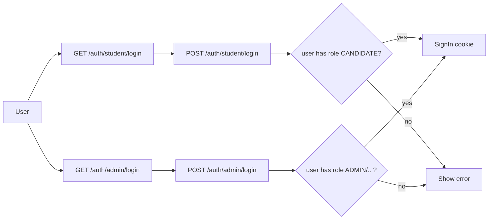

# MVC Dual Login + UI/UX (Plan)

## 1) Tài liệu UI/UX (md)

- Tạo `[wnc/docs/ui-ux-system-design.md](wnc/docs/ui-ux-system-design.md)`
- Nội dung tối thiểu:
  - Design principles (mobile-first, feedback lỗi/validations, state đăng nhập)
  - Personas: Student vs Admin/Officer
  - Layout patterns: Public portal vs Admin portal
  - Components & states: input error, error banner, CTA, loading/disabled
  - Mapping UI -> SRS: login/register/feedback theo các mục FR liên quan (đặc biệt FR-01/FR-02 trong SRS đã có)

## 2) Authentication: cookie + role codes (không dùng Identity)

- Dùng cookie authentication (`Microsoft.AspNetCore.Authentication.Cookies`)
- Claims principal chứa `role` theo bảng `roles.Code` hiện có:
  - Student: chỉ role `CANDIDATE`
  - Admin portal: cho phép `ADMIN`, `ADMISSION_OFFICER`, `REPORT_VIEWER`
- Password hashing:
  - `BCrypt.Net-Next` (Hash/Verify với cột `AppUser.PasswordHash`)
- Audit:
  - Khi login: ghi `AuthLog` với `LoginIdentifier`, `Status`, `FailureReason`, `IpAddress`, `UserAgent`.

## 3) MVC routing + “1 logic = 1 file action riêng”

Bạn chọn:

- MVC Controllers + Views
- Tách GET/POST thành **2 file riêng**

Triển khai theo endpoint:

- Student
  - `GET /auth/student/login`
  - `POST /auth/student/login`
  - `GET /auth/student/logout`
- Admin
  - `GET /auth/admin/login`
  - `POST /auth/admin/login`
  - `GET /auth/admin/logout`

## 4) Cấu trúc thư mục theo `wnc/Features/.../Authentication`

Lưu ý: controller + ViewModel đặt trong `Features` (đúng yêu cầu của bạn). Còn `.cshtml` giữ theo chuẩn MVC ở `wnc/Views/...`.

### 4.1 Student auth backend (controllers + ViewModels)

- `wnc/Features/Students/Authentication/ViewModels/StudentLoginViewModel.cs`
- `wnc/Features/Students/Authentication/Controllers/Login/StudentLoginGetController.cs`
- `wnc/Features/Students/Authentication/Controllers/Login/StudentLoginPostController.cs`
- `wnc/Features/Students/Authentication/Controllers/Logout/StudentLogoutController.cs`

### 4.2 Admin auth backend (controllers + ViewModels)

- `wnc/Features/Admin/Authentication/ViewModels/AdminLoginViewModel.cs`
- `wnc/Features/Admin/Authentication/Controllers/Login/AdminLoginGetController.cs`
- `wnc/Features/Admin/Authentication/Controllers/Login/AdminLoginPostController.cs`
- `wnc/Features/Admin/Authentication/Controllers/Logout/AdminLogoutController.cs`

## 5) Views (.cshtml) theo chuẩn MVC

- `wnc/Views/Auth/Student/Login.cshtml`
- `wnc/Views/Auth/Admin/Login.cshtml`
- (Tối thiểu) `wnc/Views/Shared/_Layout.cshtml` sẽ dùng cho toàn bộ views

## 6) Tailwind CSS qua CDN

- Modify `[wnc/Views/Shared/_Layout.cshtml](wnc/Views/Shared/_Layout.cshtml)`:
  - Thêm `` trong `<head>`
- Các trang login dùng Tailwind classes.

## 7) Cấu hình trong Program.cs (MVC + cookie auth)

- Modify `[wnc/Program.cs](wnc/Program.cs)`:
  - Thêm `builder.Services.AddAuthentication(...).AddCookie(...)`
  - Thêm `builder.Services.AddAuthorization()`
  - Pipeline thêm `app.UseAuthentication();` trước `app.UseAuthorization();`
  - Bảo đảm redirect login theo prefix:
    - Student login url: `/auth/student/login`
    - Admin login url: `/auth/admin/login`

## 8) Logic trong từng file controller (không dùng Services)

Trong mỗi `...PostController.cs`:

- Validate input ModelState
- Lấy `SystemConfig` để biết `AUTH.LOGIN_BY_EMAIL` và `AUTH.LOGIN_BY_PHONE` (seed sẵn đã có)
- Lookup `AppUser` theo `Email` hoặc `PhoneNumber` dựa vào cấu hình
- Verify password (BCrypt)
- Role check:
  - Student POST: user phải có role `CANDIDATE` (từ `user.UserRoles` + `role.Code`)
  - Admin POST: user phải có role trong {`ADMIN`, `ADMISSION_OFFICER`, `REPORT_VIEWER`}
- Nếu ok:
  - Tạo claims role
  - `HttpContext.SignInAsync(...)`
  - ghi `AuthLog` status SUCCESS
  - Redirect:
    - student => `/`
    - admin => `/`
- Nếu fail:
  - ghi `AuthLog` status FAILED + FailureReason
  - return View với error message

Trong mỗi `...GetController.cs`:

- GET login: return view với ViewModel rỗng

Trong mỗi `...LogoutController.cs`:

- SignOut + redirect về trang tương ứng

## 9) Demo seed để login chạy được

- Modify `[wnc/Data/DbInitializer.cs](wnc/Data/DbInitializer.cs)`:
  - Sau migrate, seed 2 user demo (nếu chưa tồn tại):
    - Admin: role `ADMIN`
    - Candidate: role `CANDIDATE`
  - Mật khẩu demo: `Admin@123`

## 10) Acceptance criteria

- `GET /auth/student/login` hiển thị form Student
- `POST /auth/student/login`:
  - đúng credentials + đúng role `CANDIDATE` => sign-in cookie và redirect
  - sai role => hiển thị lỗi
- `GET /auth/admin/login` hiển thị form Admin
- `POST /auth/admin/login`:
  - đúng credentials + role trong {ADMIN, ADMISSION_OFFICER, REPORT_VIEWER} => sign-in cookie
  - sai role => hiển thị lỗi
- Tailwind CDN hoạt động trên layout
- Controller + ViewModel nằm trong `wnc/Features/.../Authentication`
- GET và POST tách thành 2 file riêng theo requirement bạn chọn

## Mermaid (flow)

