# Thiết kế cơ sở dữ liệu - Hệ thống Quản lý Tuyển sinh Trực tuyến

Tài liệu này được xây dựng dựa trên `srs-enriched.md`, tập trung mô tả mô hình dữ liệu lõi cho hệ thống tuyển sinh trực tuyến của trường cao đẳng. Mục tiêu là chuẩn hóa các thực thể, quan hệ dữ liệu và sơ đồ ERD làm cơ sở cho thiết kế database vật lý ở giai đoạn triển khai.

## 1. Xác định thực thể hệ thống

### 1.1. Nhóm thực thể quản trị người dùng và phân quyền

| Thực thể | Mục đích | Thuộc tính chính | Ghi chú thiết kế |
| --- | --- | --- | --- |
| `users` | Lưu thông tin tài khoản đăng nhập của mọi nhóm người dùng | `id`, `username`, `email`, `phone_number`, `password_hash`, `status`, `last_login_at`, `created_at`, `updated_at` | Email và số điện thoại cần unique theo cấu hình hệ thống |
| `roles` | Danh mục vai trò truy cập | `id`, `code`, `name`, `description`, `is_system_role` | Bao gồm `ADMIN`, `ADMISSION_OFFICER`, `REPORT_VIEWER`, `CANDIDATE` |
| `user_roles` | Gắn vai trò cho tài khoản | `id`, `user_id`, `role_id`, `assigned_by`, `assigned_at` | Thiết kế many-to-many để mở rộng linh hoạt hơn mô hình một vai trò |
| `password_reset_tokens` | Hỗ trợ quên mật khẩu, OTP hoặc token đặt lại mật khẩu | `id`, `user_id`, `token`, `token_type`, `expired_at`, `used_at`, `created_at` | Phục vụ FR-03 |
| `auth_logs` | Lưu lịch sử đăng nhập thành công hoặc thất bại | `id`, `user_id`, `login_identifier`, `status`, `ip_address`, `user_agent`, `logged_at` | Hỗ trợ audit và phát hiện truy cập bất thường |

### 1.2. Nhóm thực thể hồ sơ thí sinh

| Thực thể | Mục đích | Thuộc tính chính | Ghi chú thiết kế |
| --- | --- | --- | --- |
| `candidates` | Lưu hồ sơ nghiệp vụ của thí sinh | `id`, `user_id`, `full_name`, `date_of_birth`, `gender`, `national_id`, `email`, `phone_number`, `address_line`, `ward`, `district`, `province_code`, `avatar_file_id`, `created_at`, `updated_at` | Quan hệ 1-1 với `users`; có thể tách khỏi `users` để dễ quản lý nghiệp vụ tuyển sinh |
| `candidate_education_profiles` | Thông tin học vấn của thí sinh | `id`, `candidate_id`, `school_name`, `graduation_year`, `education_level`, `gpa`, `academic_rank`, `province_code`, `created_at`, `updated_at` | Cho phép lưu nhiều bản ghi nếu cần nhiều bậc học hoặc nhiều nguồn dữ liệu |
| `candidate_priority_profiles` | Lưu thông tin ưu tiên khu vực, đối tượng | `id`, `candidate_id`, `priority_type`, `priority_code`, `score_value`, `evidence_file_id`, `notes` | Tách riêng để thuận lợi cấu hình và truy vết giấy tờ minh chứng |

### 1.3. Nhóm thực thể cấu hình tuyển sinh

| Thực thể | Mục đích | Thuộc tính chính | Ghi chú thiết kế |
| --- | --- | --- | --- |
| `training_programs` | Danh mục chương trình đào tạo | `id`, `program_code`, `program_name`, `education_type`, `description`, `tuition_fee`, `duration_text`, `quota`, `managing_unit`, `status`, `display_order` | Phục vụ FR-06 |
| `majors` | Danh mục ngành học thuộc chương trình | `id`, `program_id`, `major_code`, `major_name`, `description`, `quota`, `display_order`, `status` | Quan hệ 1-N từ `training_programs` |
| `admission_rounds` | Thông tin đợt tuyển sinh theo năm và thời gian mở hồ sơ | `id`, `round_code`, `round_name`, `admission_year`, `start_at`, `end_at`, `status`, `notes`, `allow_enrollment_confirmation`, `created_by`, `created_at`, `updated_at` | Phục vụ FR-08 |
| `admission_methods` | Danh mục phương thức xét tuyển | `id`, `method_code`, `method_name`, `description`, `status` | Ví dụ học bạ, điểm thi, xét tuyển thẳng |
| `round_programs` | Liên kết đợt tuyển sinh với chương trình/ngành áp dụng | `id`, `round_id`, `program_id`, `major_id`, `quota`, `published_quota`, `status` | Xử lý yêu cầu một đợt áp dụng cho một hoặc nhiều chương trình |
| `round_admission_methods` | Cấu hình phương thức xét tuyển theo đợt/chương trình | `id`, `round_program_id`, `method_id`, `combination_code`, `minimum_score`, `priority_policy`, `calculation_rule`, `status` | Gom cấu hình tổ hợp, điểm sàn, quy tắc tính điểm |
| `document_types` | Danh mục loại giấy tờ có thể yêu cầu | `id`, `document_code`, `document_name`, `description`, `status` | Ví dụ CCCD, học bạ, giấy khai sinh |
| `round_document_requirements` | Cấu hình giấy tờ bắt buộc hoặc tùy chọn cho từng đợt/chương trình | `id`, `round_program_id`, `document_type_id`, `is_required`, `requires_notarization`, `requires_original_copy`, `max_files`, `notes` | Phục vụ FR-10 |

### 1.4. Nhóm thực thể hồ sơ tuyển sinh và xử lý nghiệp vụ

| Thực thể | Mục đích | Thuộc tính chính | Ghi chú thiết kế |
| --- | --- | --- | --- |
| `admission_applications` | Thực thể trung tâm lưu hồ sơ đăng ký tuyển sinh | `id`, `application_code`, `candidate_id`, `round_program_id`, `current_status`, `submission_number`, `submitted_at`, `last_resubmitted_at`, `review_deadline_at`, `rejection_reason`, `created_at`, `updated_at`, `cancelled_at` | Mỗi hồ sơ gắn với một thí sinh và một cấu hình tuyển sinh cụ thể |
| `application_preferences` | Lưu nguyện vọng theo hồ sơ khi triển khai mô hình nhiều nguyện vọng | `id`, `application_id`, `priority_order`, `program_id`, `major_id`, `method_id`, `status` | Có thể chưa dùng ở bản đầu nhưng nên thiết kế sẵn để mở rộng |
| `application_documents` | Metadata tệp đính kèm của hồ sơ | `id`, `application_id`, `document_type_id`, `file_name`, `storage_path`, `mime_type`, `file_size`, `checksum`, `uploaded_by`, `uploaded_at`, `validation_status`, `is_latest` | Chỉ lưu metadata, không lưu binary trực tiếp trong DB |
| `application_status_histories` | Lưu lịch sử thay đổi trạng thái hồ sơ | `id`, `application_id`, `from_status`, `to_status`, `changed_by`, `changed_at`, `reason`, `public_note`, `internal_note` | Bắt buộc để đáp ứng audit và theo dõi tiến trình |
| `application_review_notes` | Lưu ghi chú nghiệp vụ của cán bộ | `id`, `application_id`, `author_user_id`, `note_type`, `content`, `is_visible_to_candidate`, `created_at` | Tách riêng khỏi status history để không trộn luồng ghi chú với luồng trạng thái |
| `application_supplement_requests` | Lưu yêu cầu bổ sung hồ sơ | `id`, `application_id`, `requested_by`, `requested_at`, `due_at`, `request_content`, `status`, `resolved_at` | Giúp quản lý riêng các lần yêu cầu bổ sung và hạn bổ sung |
| `enrollment_confirmations` | Ghi nhận xác nhận nhập học sau khi trúng tuyển | `id`, `application_id`, `confirmed_by_candidate_at`, `confirmation_status`, `notes` | Là thực thể mở rộng theo FR-23 |

### 1.5. Nhóm thực thể thông báo, báo cáo và audit

| Thực thể | Mục đích | Thuộc tính chính | Ghi chú thiết kế |
| --- | --- | --- | --- |
| `notifications` | Lưu thông báo gửi đến người dùng hoặc gắn với hồ sơ | `id`, `user_id`, `application_id`, `template_id`, `channel`, `title`, `content`, `status`, `sent_at`, `read_at`, `created_at` | Hỗ trợ email, in-app, SMS, Zalo |
| `notification_templates` | Mẫu nội dung thông báo nghiệp vụ | `id`, `template_code`, `template_name`, `channel`, `subject_template`, `body_template`, `status` | Phù hợp yêu cầu kiểm soát nội dung thông báo chính thức |
| `audit_logs` | Lưu vết thao tác hệ thống | `id`, `actor_user_id`, `entity_name`, `entity_id`, `action`, `old_data`, `new_data`, `ip_address`, `created_at` | Không cho phép chỉnh sửa thủ công |
| `system_configs` | Lưu tham số cấu hình hệ thống | `id`, `config_key`, `config_value`, `description`, `updated_by`, `updated_at` | Dùng cho chính sách đăng nhập, file upload, thời hạn token |

### 1.6. Thực thể lõi đề xuất triển khai ở phiên bản đầu

Để bám sát phạm vi MVP trong SRS, các bảng nên được ưu tiên triển khai theo thứ tự sau:

1. `users`, `roles`, `user_roles`
2. `candidates`
3. `training_programs`, `majors`
4. `admission_rounds`, `round_programs`
5. `document_types`, `round_document_requirements`
6. `admission_applications`, `application_documents`
7. `application_status_histories`, `application_review_notes`, `application_supplement_requests`
8. `notifications`, `audit_logs`

## 2. Thiết kế quan hệ dữ liệu

### 2.1. Nguyên tắc thiết kế

- Mô hình ưu tiên chuẩn hóa đến mức 3NF cho dữ liệu giao dịch cốt lõi.
- Các danh mục ít thay đổi như vai trò, loại giấy tờ, phương thức xét tuyển được tách bảng riêng để dễ cấu hình.
- Dữ liệu lịch sử như thay đổi trạng thái, đăng nhập, audit được lưu append-only để đảm bảo truy vết.
- Dữ liệu tệp chỉ lưu metadata và khóa tham chiếu tới hệ thống lưu trữ ngoài.
- Các cột `created_at`, `updated_at`, `created_by`, `updated_by`, `deleted_at` nên được chuẩn hóa xuyên suốt nếu triển khai soft delete.

### 2.2. Quan hệ chính giữa các thực thể

| Bảng cha | Bảng con | Kiểu quan hệ | Khóa ngoại | Ý nghĩa nghiệp vụ |
| --- | --- | --- | --- | --- |
| `users` | `user_roles` | 1-N | `user_roles.user_id -> users.id` | Một tài khoản có thể được gán nhiều vai trò |
| `roles` | `user_roles` | 1-N | `user_roles.role_id -> roles.id` | Một vai trò có thể áp dụng cho nhiều tài khoản |
| `users` | `candidates` | 1-1 | `candidates.user_id -> users.id` | Tài khoản thí sinh gắn với một hồ sơ thí sinh |
| `training_programs` | `majors` | 1-N | `majors.program_id -> training_programs.id` | Một chương trình có nhiều ngành |
| `admission_rounds` | `round_programs` | 1-N | `round_programs.round_id -> admission_rounds.id` | Một đợt có thể mở cho nhiều chương trình hoặc ngành |
| `training_programs` | `round_programs` | 1-N | `round_programs.program_id -> training_programs.id` | Một chương trình có thể xuất hiện ở nhiều đợt |
| `majors` | `round_programs` | 1-N, tùy chọn | `round_programs.major_id -> majors.id` | Một ngành có thể được mở tuyển trong nhiều đợt |
| `round_programs` | `round_admission_methods` | 1-N | `round_admission_methods.round_program_id -> round_programs.id` | Một cấu hình tuyển sinh có thể có nhiều phương thức xét tuyển |
| `admission_methods` | `round_admission_methods` | 1-N | `round_admission_methods.method_id -> admission_methods.id` | Một phương thức dùng ở nhiều đợt/chương trình |
| `round_programs` | `round_document_requirements` | 1-N | `round_document_requirements.round_program_id -> round_programs.id` | Mỗi cấu hình tuyển sinh có bộ hồ sơ yêu cầu riêng |
| `document_types` | `round_document_requirements` | 1-N | `round_document_requirements.document_type_id -> document_types.id` | Một loại giấy tờ có thể được tái sử dụng ở nhiều đợt |
| `candidates` | `candidate_education_profiles` | 1-N | `candidate_education_profiles.candidate_id -> candidates.id` | Một thí sinh có thể có nhiều thông tin học vấn |
| `candidates` | `candidate_priority_profiles` | 1-N | `candidate_priority_profiles.candidate_id -> candidates.id` | Một thí sinh có thể có nhiều diện ưu tiên |
| `candidates` | `admission_applications` | 1-N | `admission_applications.candidate_id -> candidates.id` | Một thí sinh có thể tạo nhiều hồ sơ qua các đợt khác nhau |
| `round_programs` | `admission_applications` | 1-N | `admission_applications.round_program_id -> round_programs.id` | Một cấu hình tuyển sinh nhận nhiều hồ sơ |
| `admission_applications` | `application_preferences` | 1-N | `application_preferences.application_id -> admission_applications.id` | Một hồ sơ có thể có nhiều nguyện vọng |
| `admission_applications` | `application_documents` | 1-N | `application_documents.application_id -> admission_applications.id` | Một hồ sơ có nhiều tệp đính kèm |
| `document_types` | `application_documents` | 1-N | `application_documents.document_type_id -> document_types.id` | Mỗi tệp được phân loại theo loại giấy tờ |
| `admission_applications` | `application_status_histories` | 1-N | `application_status_histories.application_id -> admission_applications.id` | Một hồ sơ có nhiều lần đổi trạng thái |
| `users` | `application_status_histories` | 1-N | `application_status_histories.changed_by -> users.id` | Lưu cán bộ hoặc hệ thống đã thao tác |
| `admission_applications` | `application_review_notes` | 1-N | `application_review_notes.application_id -> admission_applications.id` | Một hồ sơ có nhiều ghi chú xử lý |
| `users` | `application_review_notes` | 1-N | `application_review_notes.author_user_id -> users.id` | Xác định người tạo ghi chú |
| `admission_applications` | `application_supplement_requests` | 1-N | `application_supplement_requests.application_id -> admission_applications.id` | Một hồ sơ có thể bị yêu cầu bổ sung nhiều lần |
| `admission_applications` | `notifications` | 1-N | `notifications.application_id -> admission_applications.id` | Thông báo gắn với hồ sơ cụ thể |
| `users` | `notifications` | 1-N | `notifications.user_id -> users.id` | Một người dùng nhận nhiều thông báo |
| `notification_templates` | `notifications` | 1-N | `notifications.template_id -> notification_templates.id` | Một mẫu có thể sinh nhiều thông báo |
| `users` | `audit_logs` | 1-N | `audit_logs.actor_user_id -> users.id` | Một người dùng thực hiện nhiều thao tác |
| `admission_applications` | `enrollment_confirmations` | 1-0..1 | `enrollment_confirmations.application_id -> admission_applications.id` | Hồ sơ trúng tuyển có thể có một xác nhận nhập học |

### 2.3. Ràng buộc khóa và toàn vẹn dữ liệu

#### a. Khóa chính

- Tất cả bảng nên dùng khóa chính `id` dạng UUID hoặc bigint auto increment.
- Các mã nghiệp vụ như `application_code`, `program_code`, `round_code`, `major_code`, `document_code` phải có unique index riêng.

#### b. Khóa duy nhất

- `users.email` unique khi email được bật làm định danh đăng nhập.
- `users.phone_number` unique khi số điện thoại được bật làm định danh đăng nhập.
- `candidates.user_id` unique để đảm bảo quan hệ 1-1.
- `roles.code`, `document_types.document_code`, `admission_methods.method_code` phải unique.
- `round_programs` nên unique trên bộ `round_id`, `program_id`, `major_id` để tránh cấu hình trùng.
- `round_document_requirements` nên unique trên bộ `round_program_id`, `document_type_id`.
- `application_preferences` nên unique trên bộ `application_id`, `priority_order`.

#### c. Kiểm tra dữ liệu nghiệp vụ

- `admission_rounds.start_at < admission_rounds.end_at`.
- `training_programs.quota > 0`, `majors.quota >= 0`, `round_programs.quota >= 0`.
- Chỉ cho phép tạo `admission_applications` khi `admission_rounds.status = OPEN` và đang trong khoảng thời gian nhận hồ sơ.
- Không cho phép chuyển trạng thái hồ sơ trái quy tắc đã nêu trong SRS.
- Không cho phép hồ sơ chuyển sang `SUBMITTED` nếu chưa đủ giấy tờ bắt buộc trong `round_document_requirements`.

### 2.4. Đề xuất mapping trạng thái hồ sơ

| Mã trạng thái | Ý nghĩa |
| --- | --- |
| `DRAFT` | Nháp |
| `PENDING_SUBMISSION` | Chờ nộp |
| `SUBMITTED` | Đã nộp |
| `UNDER_REVIEW` | Đang kiểm tra |
| `SUPPLEMENT_REQUESTED` | Yêu cầu bổ sung |
| `SUPPLEMENT_SUBMITTED` | Đã bổ sung |
| `EVALUATING` | Đang xét duyệt |
| `APPROVED` | Đã duyệt |
| `REJECTED` | Bị từ chối |
| `CANCELLED` | Hủy hoặc hết hạn |

### 2.5. Đề xuất chiến lược tách bảng theo miền nghiệp vụ

- Miền `identity_access`: `users`, `roles`, `user_roles`, `password_reset_tokens`, `auth_logs`
- Miền `admission_catalog`: `training_programs`, `majors`, `admission_rounds`, `admission_methods`, `round_programs`, `round_admission_methods`, `document_types`, `round_document_requirements`
- Miền `candidate_management`: `candidates`, `candidate_education_profiles`, `candidate_priority_profiles`
- Miền `application_processing`: `admission_applications`, `application_preferences`, `application_documents`, `application_status_histories`, `application_review_notes`, `application_supplement_requests`, `enrollment_confirmations`
- Miền `communication_audit`: `notifications`, `notification_templates`, `audit_logs`, `system_configs`

## 3. ERD

```mermaid
erDiagram
    USERS ||--o{ USER_ROLES : has
    ROLES ||--o{ USER_ROLES : grants
    USERS ||--o| CANDIDATES : owns
    USERS ||--o{ PASSWORD_RESET_TOKENS : requests
    USERS ||--o{ AUTH_LOGS : creates

    TRAINING_PROGRAMS ||--o{ MAJORS : includes
    ADMISSION_ROUNDS ||--o{ ROUND_PROGRAMS : opens
    TRAINING_PROGRAMS ||--o{ ROUND_PROGRAMS : applies_to
    MAJORS o|--o{ ROUND_PROGRAMS : scopes
    ROUND_PROGRAMS ||--o{ ROUND_ADMISSION_METHODS : configures
    ADMISSION_METHODS ||--o{ ROUND_ADMISSION_METHODS : uses
    ROUND_PROGRAMS ||--o{ ROUND_DOCUMENT_REQUIREMENTS : requires
    DOCUMENT_TYPES ||--o{ ROUND_DOCUMENT_REQUIREMENTS : defines

    CANDIDATES ||--o{ CANDIDATE_EDUCATION_PROFILES : has
    CANDIDATES ||--o{ CANDIDATE_PRIORITY_PROFILES : has
    CANDIDATES ||--o{ ADMISSION_APPLICATIONS : submits
    ROUND_PROGRAMS ||--o{ ADMISSION_APPLICATIONS : receives

    ADMISSION_APPLICATIONS ||--o{ APPLICATION_PREFERENCES : contains
    ADMISSION_APPLICATIONS ||--o{ APPLICATION_DOCUMENTS : attaches
    DOCUMENT_TYPES ||--o{ APPLICATION_DOCUMENTS : classifies
    ADMISSION_APPLICATIONS ||--o{ APPLICATION_STATUS_HISTORIES : tracks
    USERS ||--o{ APPLICATION_STATUS_HISTORIES : changes
    ADMISSION_APPLICATIONS ||--o{ APPLICATION_REVIEW_NOTES : stores
    USERS ||--o{ APPLICATION_REVIEW_NOTES : writes
    ADMISSION_APPLICATIONS ||--o{ APPLICATION_SUPPLEMENT_REQUESTS : requests
    ADMISSION_APPLICATIONS ||--o| ENROLLMENT_CONFIRMATIONS : confirms

    USERS ||--o{ NOTIFICATIONS : receives
    ADMISSION_APPLICATIONS ||--o{ NOTIFICATIONS : triggers
    USERS ||--o{ AUDIT_LOGS : performs
    NOTIFICATION_TEMPLATES ||--o{ NOTIFICATIONS : renders
```

### 3.1. Giải thích ERD

- `admission_applications` là bảng trung tâm của toàn bộ nghiệp vụ tuyển sinh.
- `round_programs` đóng vai trò bảng cấu hình trung gian giúp hệ thống biểu diễn đúng quan hệ giữa đợt tuyển sinh, chương trình và ngành.
- `application_status_histories` và `audit_logs` là hai lớp lưu vết khác nhau: một lớp cho nghiệp vụ hồ sơ, một lớp cho thao tác hệ thống tổng quát.
- `application_documents` liên kết chặt với `round_document_requirements` thông qua `document_type_id`, từ đó kiểm tra đủ hồ sơ trước khi nộp.
- `notifications` gắn đồng thời với `users` và `admission_applications` để vừa phục vụ inbox người dùng, vừa truy xuất lịch sử thông báo theo hồ sơ.

### 3.2. Khuyến nghị triển khai vật lý

- Dùng chỉ mục cho các cột tra cứu nhiều như `application_code`, `current_status`, `submitted_at`, `round_program_id`, `candidate_id`, `province_code`.
- Partition hoặc archive dữ liệu dài hạn cho `audit_logs`, `auth_logs`, `application_status_histories` khi hệ thống tăng trưởng.
- Mã hóa hoặc che dữ liệu nhạy cảm như CCCD/CMND, email, số điện thoại ở tầng lưu trữ và hiển thị.
- Nếu dùng SQL Server hoặc PostgreSQL, nên chuẩn hóa enum trạng thái ở mức application code kết hợp constraint trong DB.
